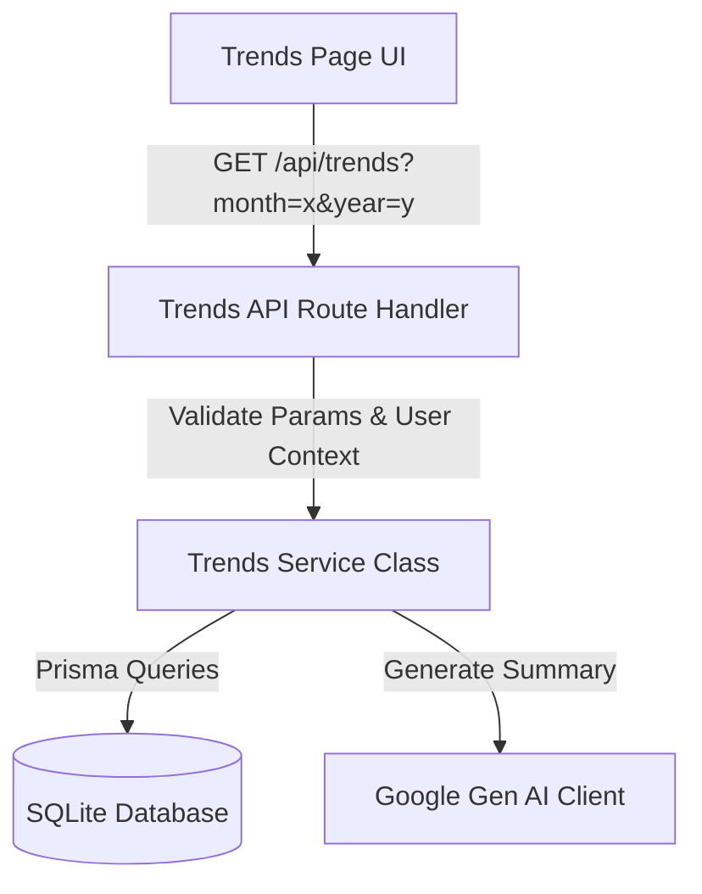

# Trends API Design & Implementation Plan
**Date:** 2026-07-07

This specification describes the backend and frontend changes required to populate the `/trends` page with live database values, replacing the current static mocks.

## 1. Dynamic Value Requirements

To support the visual layouts and charts on the Trends page, the API must provide the following aggregated financial metrics for a user-specified month and year:

### A. Core Metrics & Currency Info
- **`currency`**: The preferred base currency code of the user (e.g., `USD`, `IDR`, `JPY`), retrieved from the user's settings/profile.
- **`locale`**: The appropriate locale format string mapped to the currency (e.g., `en-US` for `USD`, `id-ID` for `IDR`) to avoid hydration discrepancies.

### B. Spending Trend (`trend`)
- **Visual**: Line chart showing cumulative or daily progression of expenses over the selected month.
- **Data Shape**: Array of daily objects:
  ```ts
  trend: Array<{ day: string; amount: number }>
  ```
  *Note:* `amount` must be in the major units of the currency (e.g., `USD` in dollars, not cents).
- **Calculation**: Filter `Transaction` records of type `EXPENSE` belonging to the current user with a date matching the selected month/year. Group by day of the month and sum the amounts.

### C. Category Breakdown (`categories`)
- **Visual**: Donut chart showing relative proportions of expense categories.
- **Data Shape**:
  ```ts
  categories: Array<{ name: string; amount: number; color: string }>
  ```
- **Calculation**: Filter `Transaction` records of type `EXPENSE` for the month/year. Group by category and sum `amountMinor`. Sort by total spending descending. Match with category metadata (`name`, `color`).

### D. Budgets Progress (`budgets`)
- **Visual**: Grid of progress cards indicating budget limit vs. actual spending.
- **Data Shape**:
  ```ts
  budgets: Array<{
    id: string;
    name: string;
    spent: number;
    limit: number;
    iconName: string;
    iconColor: string;
    barColor: string;
    statusText: string;
    statusColor: string;
    iconFill: boolean;
  }>
  ```
- **Calculation**: 
  1. Fetch all `Budget` configurations for the user.
  2. For each budget, calculate the total `EXPENSE` transaction sum within the category for the selected month/year.
  3. Map UI-specific keys (like `iconName`, `barColor`, `statusText`) dynamically based on the spent-to-limit ratio:
     - `ratio <= 0.7`: Safe (green bar, "X left" text, `check_circle` icon)
     - `0.7 < ratio <= 1.0`: Warning (amber bar, "X left" text, `warning` icon)
     - `ratio > 1.0`: Over budget (red bar, "X over" text, `error` icon)

### E. Period Comparison (`comparison`)
- **Visual**: Net difference card detailing the current month's pace vs. the previous month.
- **Data Shape**:
  ```ts
  comparison: {
    thisPeriod: number;
    prevPeriod: number;
    percentChange: number;
  }
  ```
- **Calculation**:
  - `thisPeriod`: Sum of expenses for the selected month/year.
  - `prevPeriod`: Sum of expenses for the prior month/year (handling December-to-January year boundaries).
  - `percentChange`: Percentage difference. Handle division-by-zero if `prevPeriod` is 0.

### F. AI Insights (`aiInsight`)
- **Visual**: Top hero card with a summary of financial performance.
- **Data Shape**: `string`
- **Calculation**: Construct a prompt with the user's spending data and budget limits, calling `gemini-2.5-flash` to get a succinct natural language summary. Include a structured, rule-based fallback sentence if the LLM request fails.

---

## 2. Technical Architecture

We will implement this cleanly, decoupling business logic from API handlers and frontend rendering.



### Backend: Service Layer (`lib/services/trends.service.ts`)
Create a dedicated `TrendsService` to perform all database aggregation and calculation. This keeps the codebase maintainable and aligns with other services like `BudgetService` and `DashboardService`.

### Backend: Route Handler (`app/api/trends/route.ts`)
The API route handler handles only:
- Session/Authorization checking via `auth()`.
- Request parameter extraction and Zod validation (`month`, `year`).
- Response serialization and HTTP status codes.

### Frontend: Trends Page (`app/trends/page.tsx`)
- Convert the page to dynamically fetch data on component mount or parameter change.
- Retain loading states using `<Skeleton>` layouts during active requests.

---

## 3. Implementation Steps

1. **Service Layer Setup**: Create [trends.service.ts](file:///home/milo/personal-project/capital-tracker/lib/services/trends.service.ts) and write the aggregation queries and helpers.
2. **API Route Creation**: Create [route.ts](file:///home/milo/personal-project/capital-tracker/app/api/trends/route.ts) with appropriate Zod schema validation.
3. **Unit Tests**: Create [trends.service.spec.ts](file:///home/milo/personal-project/capital-tracker/tests/unit/trends.service.spec.ts) covering date ranges, sum aggregations, and edge cases.
4. **UI Integration**: Modify [app/trends/page.tsx](file:///home/milo/personal-project/capital-tracker/app/trends/page.tsx) to query the endpoint and dynamically bind the charts and budget progress elements.
